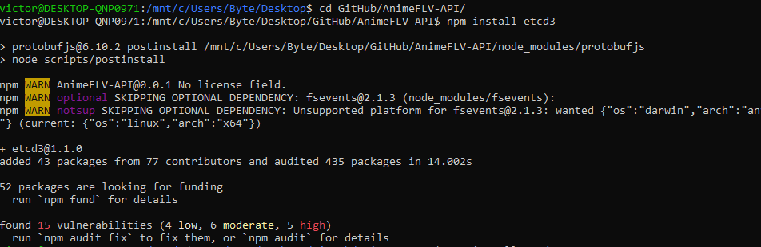
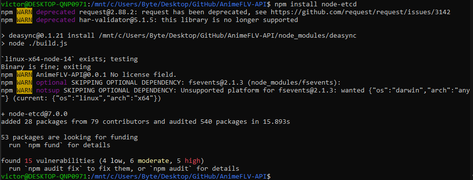
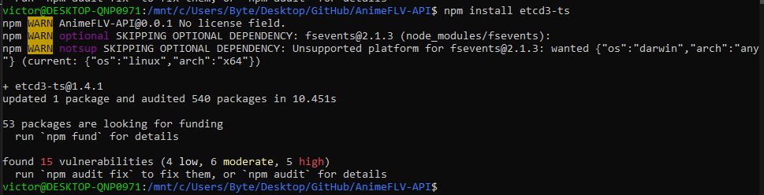
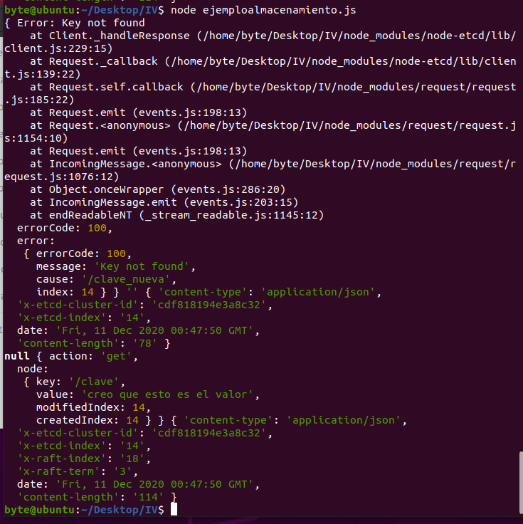
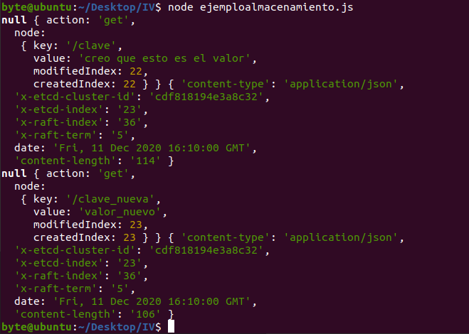
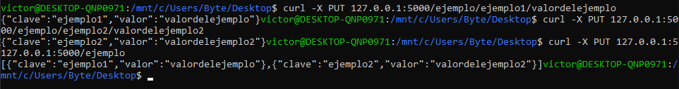
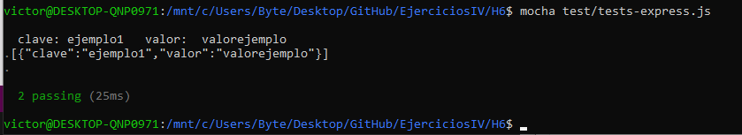

# Ejercicio 1

Instalación de etcd3

Extensión de etcd3 para node

Extensión para Typescript

### Prueba

En mi caso uso el subsistema de windows para linux cada vez que necesito ejecutar algo en linux, en este caso etcd tiene un problema que no lo hace compatible con el WSL, por ende he tenido que utilizar una máquina virtual con ubuntu 20 que tengo para este tipo de ocasiones (es bastante común que de fallos con ciertos programas, por ejemplo mongodb no funciona correctamente en WSL).

Hemos reinstalado etcd, etcdctl y node-etcd en la máquina virtual.

El archivo que vamos a ejecutar para obtener los valores es [el siguiente](https://github.com/bytevictor/EjerciciosIV/blob/master/H6/ejemploalmacenamiento.js)

En esta primera ejecución no hemos incluido una de las dos variables que buscamos.

Parece que lanza una excepción pero es simplemetne la forma que tiene de mostrar el error al no encontrar la clave.

Ahora añadimos una nueva clave valor usando

> etcdctl put clave_nueva valor_nuevo

Y al volver a ejecutar tenemos obtenemos desde el ejemplo.js los valores

Como vemos devuelve ambos valores correctamente

# Ejercicio 2 y 3

Tras ejecutar los ejemplos hemos programado [El siguiente ejemplo](https://github.com/bytevictor/EjerciciosIV/blob/master/H6/express-ejemplo.js)

Contamos con una función PUT con la que podemos añadir datos clave-valor con una petición PUT

> curl -X PUT 127.0.0.1:5000/ejemplo/ejemplo1/valordelejemplo

Y podemos obtener toda la lista de claves-valor almacenadas con:

> curl -X PUT 127.0.0.1:5127.0.0.1:5000/ejemplo

Ejemplo de ejecución

# Ejercicio 4

Se han implementado dos tests, uno para cada ruta solicitada.

Se pueden encontrar [AQUI](https://github.com/bytevictor/EjerciciosIV/blob/master/H6/test/tests-express.js)

Los tests se pasan correctamente

